# wanted-preonboarding-challenge-backend-25
원티드 프리온보딩 백엔드 챌린지 사전과제

<link href="https://cdnjs.cloudflare.com/ajax/libs/github-markdown-css/5.1.0/github-markdown.css" rel="stylesheet">

## 프로젝트 필수 패키지 및 버전 정보
### 버전 정보
- Spring Boot; 3.3.5
- JDK(Java Development Kit); Java 21 이상
    - Intellij에서 JDK 버전 변경하는 방법(참고 URL: https://inpa.tistory.com/entry/IntelliJ-%F0%9F%92%BD-%EC%9E%90%EB%B0%94-JDK-%EB%B2%84%EC%A0%84-%EB%B3%80%EA%B2%BD-%EB%B0%A9%EB%B2%95)
### 필수 설치 패키지
- Docker Desktop

# 과제 설명
- 시간이 없는 수강생들은 과제1과 과제2 중 하나를 선택해서 진행하셔도 무방합니다.
- 코드를 작성할 시간이 없다면, 과제1를 선택하고 설계 도면만 그려 주세요!
- 과제3은 선택사항입니다.

## 필수 과제1 - 설계 
고객의 요구사항: 다수의 PG사 결제 서비스를 하나의 APIs로 통합해서 서비스를 이용할 수 있는 서비스를 만들어 주세요.

### 비즈니스 요구사항
1. 다양한 PG사의 API를 어떻게(How?) 제공할 것인가?
   - 고객사에 최초 요구사항에는 연동 가능한 PG사 갯수 1개지만, 가까운 미래에는 더 추가될 수 있다.
   - 연동할 PG사 브랜드 선택은 자유이며, 자신에게 편한 PG사를 선택하시면 됩니다.  
   - 설계 시, 확장 가능성을 고려 해야 한다. 
2. PG사 마다 요청 메시지와 응답 메시지의 형식이 다른데, 어떻게(How?)하면 깨끗하게 공통화 시킬 수 있을까?
   - RequestDTO를 어떤 구조로 각각의 PG사에 맞게 효율적으로 변환 할 것인가?
   - 각각의 PG사에서 응답해주는 **메시지의 형식**을 어떻게 형식을 공통화하고 어떤 **구조**로 변환 할 것인가?
### 과제 내용
요구사항을 만족하는 설계 도면을 그려 주세요.
- [x] 클래스 다이어그램

- [x] 아키텍처 구조

```mermaid
  graph TB
  Client[Client Application] --> API[API Gateway]
  API --> APP[Application Server]

  subgraph Payment Service
  APP[Application Server]
  APP --> DB[(Database)]
  end

  subgraph Payment Processors
  APP --> KG[KG이니시스 Adapter]
  APP --> Naver[네이버페이 Adapter]
  APP --> Future[Future PG Adapter...]
  end

  KG --> KG_API[KG이니시스 API]
  Naver --> Naver_API[네이버페이 API]
  Future --> Future_API[Future PG API]
```

- [x] ERD


### 환경 설정과 Github에 대한 궁금증이 있다면! Issues에 등록해주시면 답변 드리겠습니다.
- https://github.com/jinho-yoo-jack/wanted-preonboarding-challenge-backend-16/issues
- 참고 URL: https://devlog-wjdrbs96.tistory.com/227

## 필수 과제2 - 구현
과제1에서 완성한 설계 도면을 토대로 요구사항을 만족하는 서비스를 구현해보자.
- [ ] 자신의 PC에 프로젝트 Clone
- [ ] 설계 도면에 맞게 프로젝트 구조 생성
- [ ] 설계 도면에 맞게 src/main/resources/initdb/create_schema.sql 테이블 정의 및 수정
- [ ] PG사 API 구현
  - 결제 요청 API 
    - 기능 설명; PG사 결제 위젯 UI를 응답하는 API
  - 결제 승인 API 
    - 기능 설명; 결제 위젯을 통해서 전달 받은 KEY 값을 이용해서 "결제 승인"을 요청하는 API
  - 결제 취소 API
      - 기능 설명; "결제 승인"이 정상적으로 완료된 후, 응답 받은 거래 KEY_ID로 취소 요청할 수 있는 API

## 선택 과제3 - 비교해보기
- 다른 사람의 PR 염탐하기!
- **백문이 불여일견**이라고 했습니다! 다른 사람의 코드를 보고 궁금한 점이나 코드 작성의 의도를 물어봐 주세요! 또는 코드에 대해서 자신의 생각을 코멘트로 달아주세요!
- 코드 리뷰를 통해서 내가 놓친 부분이나 미처 생각 하지 못했던 부분을 깨닫을 수 있고, 좋은 코드와 나쁜 코드가 무엇인지 경험할 수 있습니다!
- PR에 코멘트를 달아도!🌱<span style='color:#dcffe4'>**잔디**</span>가 심어진다는 사실 알고 계신가요?!!!!

## 과제 제출 방법
1. master 브랜치로 프로젝트를 clone 해주세요.
2. 로컬 레파지토리에 `feature/이름or닉네임`으로 피쳐 브랜치를 생성해주세요.
4. 이제부터 사전과제를 풀어봅니다.
5. 모든 사전과제를 풀었다면 이제 원격 레파지토리에 commit 및 push 후 PR을 올려 해주세요.
6. Example
   ```shell
    1. git checkout -b feature/migration2TcAsMasterSlaveStructure
    # 브랜치를 생성하고 해당 브랜치로 checkout.
    # feature의 브랜치명은 내부적으로 관리하는 issues번호나 프로젝트 관리도구에의 ID 값을 이용
    2. git add .
    # 모든 변경사항을 tracking 되는 상태로 변경할거에요.
    3. git commit -m “Commit Messsage for Modify Information”
    # git commit를 수행하고 작업내용을 팀 내부 규약대로 작성
    3-1. git push --set-upstream origin feature/migration2TcAsMasterSlaveStructure
    # 해당 내용을 remote repository로 push
    4. push하면 gitlab/github에 Pull Request나 Merge Request 생성하는 버튼이 활성화
    5. Merge Request 버튼을 클릭 후, 숙제에 관한 내용 작성 후 PR 요청을 보내면 끝
    6. Merge 승인이되면 WEB UI화면에서 merge 버튼이 활성화 됨.
   ```